# PicoRV32 AXI SoC — RTL-to-GDSII Physical Design with LibreLane and SKY130

**Complete hierarchical RTL-to-GDSII physical-design implementation of
a PicoRV32-based AXI-Lite SoC using LibreLane, OpenROAD, Yosys, OpenRCX,
KLayout and Netgen with the SkyWater SKY130 PDK.**

RTL → Simulation → Synthesis → Floorplan → Macro Placement → PDN →
Placement → CTS → Routing → ECO → STA → DRC → LVS → GDSII

------------------------------------------------------------------------

## Final GDSII

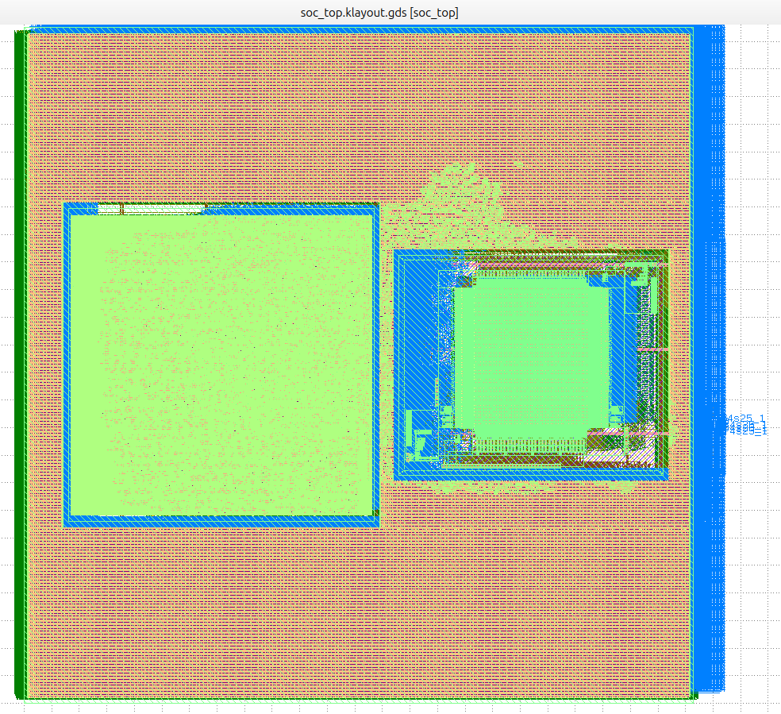
*Final hierarchical SoC layout after routing, ECO timing closure,
refill, RC extraction and physical verification.*

------------------------------------------------------------------------

## Table of Contents

- [Project Overview](#project-overview)
- [SoC Architecture](#soc-architecture)
- [Memory Map](#memory-map)
- [Boot ROM and UART Bring-up](#boot-rom-and-uart-bring-up)
- [RTL Simulation](#rtl-simulation)
- [RTL Design](#rtl-design)
- [Tools and Technology Stack](#tools-and-technology-stack)
- [Design Configuration](#design-configuration)
- [Physical Design Flow](#physical-design-flow)
- [1. Synthesis](#1-synthesis)
- [2. Floorplanning](#2-floorplanning)
- [3. Hierarchical Macro Placement](#3-hierarchical-macro-placement)
- [4. Power Distribution Network](#4-power-distribution-network)
- [5. Global Placement](#5-global-placement)
- [6. Detailed Placement](#6-detailed-placement)
- [7. Clock Tree Synthesis](#7-clock-tree-synthesis)
- [8. Global Routing](#8-global-routing)
- [9. Detailed Routing](#9-detailed-routing)
- [10. ECO19 Timing Closure](#10-eco19-timing-closure)
- [11. Post-Route Static Timing
  Analysis](#11-post-route-static-timing-analysis)
- [12. Antenna Verification](#12-antenna-verification)
- [13. Design Rule Checking](#13-design-rule-checking)
- [14. Layout Versus Schematic](#14-layout-versus-schematic)
- [15. Final GDSII](#15-final-gdsii)
- [Final Results](#final-results)
- [Full RTL-to-GDSII
  Reproducibility](#full-rtl-to-gdsii-reproducibility)
- [Repository Structure](#repository-structure)
- [Reproducing the Flow](#reproducing-the-flow)
- [Engineering Notes](#engineering-notes)
- [References](#references)
- [Final Status](#final-status)

------------------------------------------------------------------------

## Project Overview

This project demonstrates a complete **hierarchical ASIC RTL-to-GDSII
physical-design flow** for a PicoRV32-based AXI-Lite SoC.

The implementation uses **LibreLane v3.0.1**, **OpenROAD**, **Yosys**,
**OpenRCX**, **KLayout** and **Netgen** with the **SkyWater SKY130**
open-source PDK.

Unlike a single flat CPU-only implementation, the design is organized
hierarchically. The top-level SoC integrates:

- A PicoRV32 CPU implemented as the hard macro `cpu_block`
- A 1-KB SKY130 SRAM macro
- Boot ROM
- AXI-Lite interconnect
- UART peripheral
- Supporting AXI-Lite logic

The physical-design flow covers:

- RTL simulation and bring-up
- Logic synthesis
- Hierarchical macro integration
- Floorplanning
- Power Distribution Network generation
- Global and detailed placement
- Clock Tree Synthesis
- Global and detailed routing
- Timing optimization and ECO
- RC parasitic extraction
- Multi-corner post-route STA
- Antenna checking
- GDSII generation
- KLayout DRC
- Netgen LVS
- Final manufacturability reporting
- Full RTL-to-GDSII reproducibility

### Final Results

| Metric                     |                       Result |
|:---------------------------|-----------------------------:|
| Technology                 |                       SKY130 |
| Standard Cell Library      |            `sky130_fd_sc_hd` |
| Target Clock Period        |                    **20 ns** |
| Target Frequency           |                   **50 MHz** |
| Final Instance Utilization |                 **37.5833%** |
| Standard-Cell Utilization  |                  **4.0435%** |
| Setup WNS                  |               **+1.6043 ns** |
| Hold WNS                   |               **+0.0893 ns** |
| Setup Violations           |                        **0** |
| Hold Violations            |                        **0** |
| Max Cap Violations         |                        **0** |
| Max Slew Violations        |                        **0** |
| Worst SRAM Input Slew      |              **0.039473 ns** |
| SRAM Slew Limit            |              **0.040000 ns** |
| Remaining Slew Margin      |   **0.000527 ns / 0.527 ps** |
| Routing DRT Markers        |                        **0** |
| Antenna Violations         |          **0 nets / 0 pins** |
| LVS Devices                |              **1802 / 1802** |
| LVS Nets                   |              **1828 / 1828** |
| KLayout DRC                |          **PASS — 0 errors** |
| Full RTL-to-GDSII Flow     | **81 / 81 stages completed** |

> **Timing note:** The +1.6043 ns setup WNS and +0.0893 ns hold WNS are
> from the native post-route verification run using the
> schema-compatible final ECO19 database. The full 81/81 reproducibility
> run independently completed the complete flow and sign-off checkers.

> **Physical-verification note:** KLayout DRC passed with zero errors.
> The final full-flow log did not report a Magic DRC result, so this
> README does not claim a Magic DRC PASS.

------------------------------------------------------------------------

## SoC Architecture

The top-level design is `soc_top`. The CPU is integrated hierarchically
as the `cpu` instance with master macro `cpu_block`.

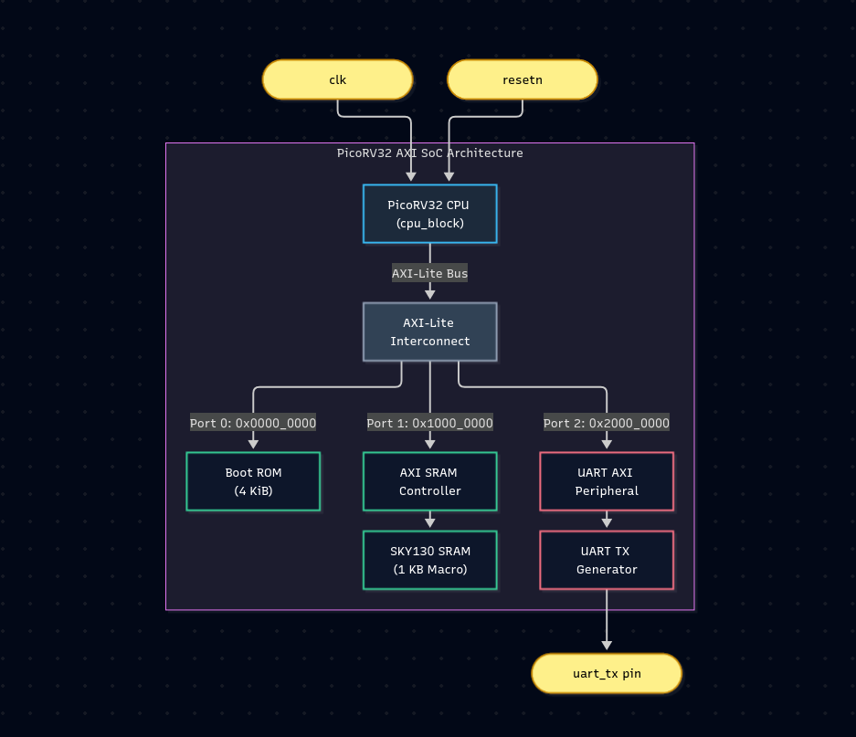
*Top-level SoC architecture and hierarchical integration.*

### Main Blocks

| Block                 | Function                                      |
|:----------------------|:----------------------------------------------|
| `cpu` / `cpu_block`   | PicoRV32 CPU hard macro                       |
| Boot ROM              | Initial instruction storage                   |
| `ram.u_sram_macro`    | SKY130 1-KB SRAM macro                        |
| UART                  | Memory-mapped serial output                   |
| AXI-Lite interconnect | Routes CPU transactions to ROM, SRAM and UART |

### Hierarchical Physical Structure

The physical implementation contains two important hard-macro regions:

- **CPU macro:** `cpu` → `cpu_block`
- **SRAM macro:** `ram.u_sram_macro`

The CPU macro contains its own internal standard-cell implementation. At
the top level, it is treated as a hard macro with abstract physical and
timing collateral.

------------------------------------------------------------------------

## Memory Map

| Address Range               | Block    |  Size |
|:----------------------------|:---------|------:|
| `0x0000_0000 – 0x0000_0FFF` | Boot ROM | 4 KiB |
| `0x1000_0000 – 0x1000_03FF` | SRAM     | 1 KiB |
| `0x2000_0000 – 0x2000_0FFF` | UART     | 4 KiB |

The AXI-Lite interconnect provides access from the CPU to the
memory-mapped peripherals.

------------------------------------------------------------------------

## Boot ROM and UART Bring-up

The repository includes a small **Boot ROM / UART bring-up demo** used
to demonstrate that the SoC can execute a simple bare-metal instruction
sequence and access the memory-mapped UART.

The current ROM is intentionally a **bring-up demonstration**, not a
complete operating system or application firmware.

The program:

1.  Loads the UART base address.
2.  Writes the UART prescale/configuration value.
3.  Writes `H`.
4.  Writes `i`.
5.  Loops indefinitely.

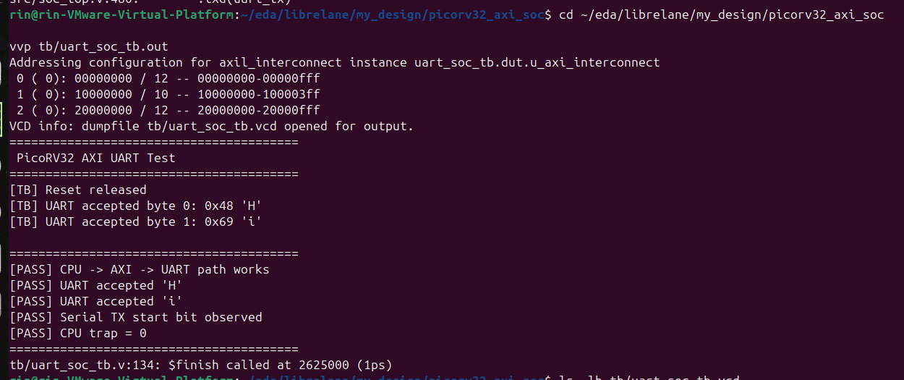
*Boot ROM / UART bring-up demonstration.*

The RTL source is:

``` text
src/boot_rom.v
```

------------------------------------------------------------------------

## RTL Simulation

The repository contains an RTL-level UART SoC simulation environment.

Example:

``` bash
cd ~/eda/librelane/my_design/picorv32_axi_soc

vvp tb/uart_soc_tb.out
ls -lh tb/uart_soc_tb.vcd
gtkwave tb/uart_soc_tb.vcd
```

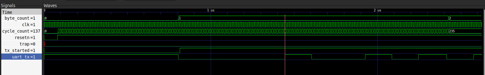
*RTL simulation and UART waveform.*

> **Simulation scope:** this testbench is an RTL/SoC simulation
> environment. It is not a gate-level simulation of the final GDSII
> database.

------------------------------------------------------------------------

## RTL Design

The SoC RTL is organized into reusable blocks for the AXI-Lite data path
and peripherals.

Important RTL sources include:

``` text
src/
├── priority_encoder.v
├── arbiter.v
├── axil_interconnect.v
├── axil_sram.v
├── boot_rom.v
├── uart_tx.v
└── uart_axil.v
```

The hierarchical physical-design top is:

``` text
v3_hier/top/src/soc_top_hier.v
```

The final flow uses the hierarchical top-level `soc_top` and integrates
the CPU as a hard macro.

------------------------------------------------------------------------

## Tools and Technology Stack

| Stage                       | Tool / Technology                     |
|:----------------------------|:--------------------------------------|
| RTL                         | Verilog / PicoRV32-based SoC          |
| RTL Simulation              | Icarus Verilog / GTKWave              |
| Logic Synthesis             | Yosys                                 |
| Technology Mapping          | ABC                                   |
| Floorplan / Placement / CTS | OpenROAD                              |
| Routing                     | OpenROAD                              |
| Static Timing Analysis      | OpenSTA / OpenROAD                    |
| RC Extraction               | OpenRCX                               |
| GDSII / Layout              | OpenROAD / KLayout / Magic collateral |
| DRC                         | OpenROAD routing DRC / KLayout        |
| LVS                         | Netgen                                |
| Flow Controller             | LibreLane v3.0.1                      |
| PDK                         | SkyWater SKY130                       |
| Standard Cells              | `sky130_fd_sc_hd`                     |
| SRAM                        | SKY130 SRAM macro                     |

------------------------------------------------------------------------

## Design Configuration

The main full-reproducibility configuration is:

``` text
v3_hier/top/config_top_newcpu_eco19_full_repro_50mhz.json
```

The PnR timing constraint file is:

``` text
v3_hier/top/constraints/top_50mhz_eco19_repro_pnr.sdc
```

### Main Constraints

| Parameter                |                               Value |
|:-------------------------|------------------------------------:|
| Clock Period             |                           **20 ns** |
| Target Frequency         |                          **50 MHz** |
| Top Design               |                           `soc_top` |
| CPU Macro Instance       |                               `cpu` |
| CPU Macro Master         |                         `cpu_block` |
| SRAM Instance            |                  `ram.u_sram_macro` |
| SRAM Macro               | `sky130_sram_1kbyte_1rw1r_32x256_8` |
| Effective Max Slew Limit |                        **0.040 ns** |

The final implementation was not accepted based only on setup/hold
timing. The ECO19 closure also checked maximum slew, maximum
capacitance, routing DRT markers, antenna, DRC and LVS.

------------------------------------------------------------------------

## Physical Design Flow

``` text
                         SoC RTL
                           │
                           ▼
                    RTL Simulation
                           │
                           ▼
                        Yosys
                      Synthesis
                           │
                           ▼
                       Floorplan
                           │
                           ▼
                  Macro Integration
                  ┌────────┴────────┐
                  │                 │
              CPU Macro         SRAM Macro
                  │                 │
                  └────────┬────────┘
                           ▼
                           PDN
                           │
                           ▼
                    Global Placement
                           │
                           ▼
                   Detailed Placement
                           │
                           ▼
                          CTS
                           │
                           ▼
                    Global Routing
                           │
                           ▼
                   Detailed Routing
                           │
                           ▼
                     ECO19 Closure
                           │
                           ▼
                      RC Extraction
                           │
                           ▼
                    Post-Route STA
                           │
             ┌─────────────┼─────────────┐
             ▼             ▼             ▼
          Antenna         DRC           LVS
             │             │             │
             └─────────────┴─────────────┘
                           ▼
                         GDSII
```

------------------------------------------------------------------------

# 1. Synthesis

Logic synthesis converts the RTL description into a technology-mapped
gate-level implementation.

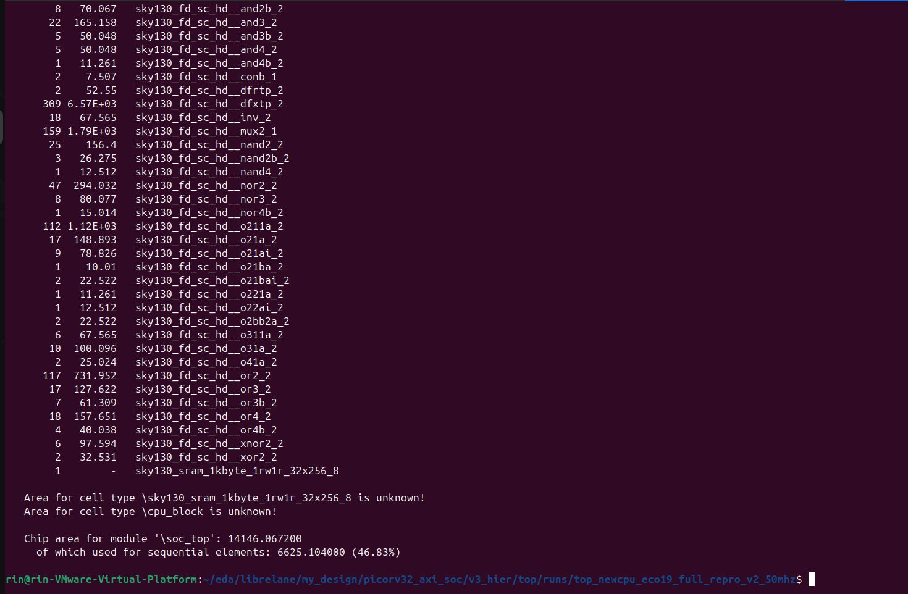
*Yosys synthesis result and technology-mapped implementation.*

The earlier Yosys synthesis report for the top-level module reported:

``` text
Chip area for module '\soc_top': 14146.067200
```

with a reported sequential-cell area of:

``` text
6625.104000
```

> The Yosys area is a synthesized-cell metric. It should not be
> interpreted as the final physical die area or final physical
> utilization, especially for this hierarchical implementation
> containing hard macros.

The synthesis stage provides the gate-level structure used by the
physical-design flow.

------------------------------------------------------------------------

# 2. Floorplanning

Floorplanning establishes the physical die/core region, placement rows
and the locations reserved for major macros.

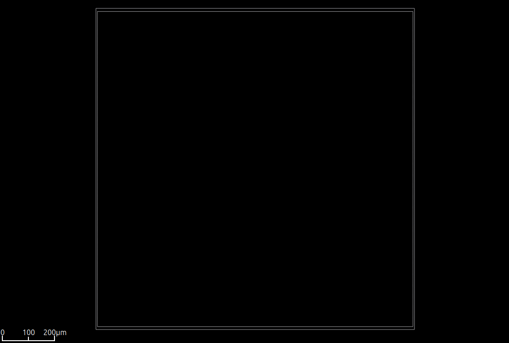
*Top-level floorplan with the hierarchical macro regions.*

The final floorplan intentionally retains whitespace around the
implemented logic and macros.

This space is important for:

- signal routing
- clock-tree insertion
- buffering
- timing repair
- power distribution
- physical-only cells
- detailed-routing resources

A visually large empty region is therefore not automatically a
physical-design problem.

------------------------------------------------------------------------

# 3. Hierarchical Macro Placement

The top-level SoC contains two major hard-macro regions: the CPU and the
SRAM.

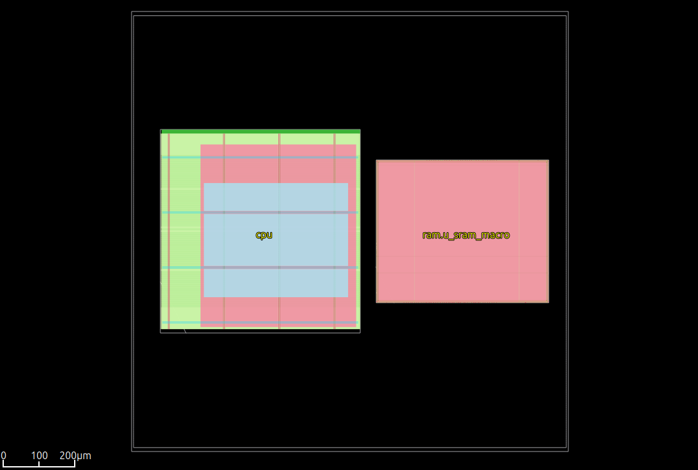
*Hierarchical CPU and SRAM macro placement.*

The CPU is integrated as:

``` text
Instance: cpu
Master:   cpu_block
```

The SRAM is integrated as:

``` text
Instance: ram.u_sram_macro
Master:   sky130_sram_1kbyte_1rw1r_32x256_8
```

The CPU macro contains its own internal standard-cell implementation. At
the top level, it is treated as a hard macro with abstract physical and
timing collateral.

This hierarchical organization reduces the top-level implementation
problem into a manageable combination of macro integration and top-level
interconnect.

------------------------------------------------------------------------

# 4. Power Distribution Network

The Power Distribution Network distributes the supply rails through the
top-level physical implementation.

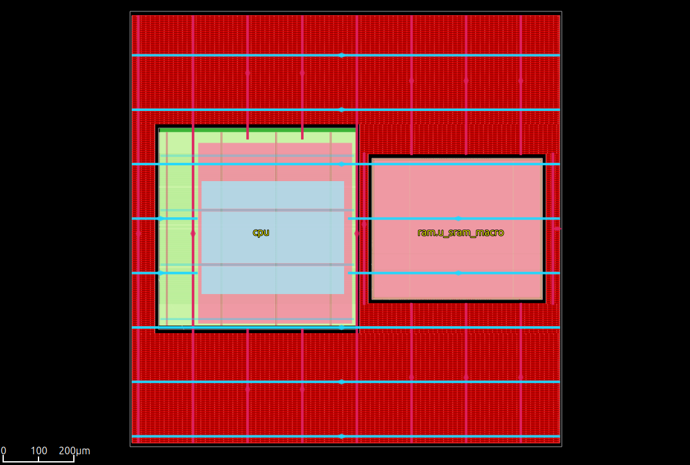
*Power Distribution Network and top-level power straps.*

The PDN is established before the final placement and routing stages so
that standard-cell power connections and macro power connectivity are
physically available.

The final flow reported no power-grid checker violations in the sign-off
checks that were run.

------------------------------------------------------------------------

# 5. Global Placement

Global placement determines approximate locations for the top-level
standard cells while considering connectivity, wirelength, timing and
routability.


*Global placement checkpoint.*

At this stage the placement is an optimization solution rather than the
final legalized cell arrangement.

Strongly connected logic is spatially organized to reduce estimated
interconnect cost and improve the starting point for detailed placement,
CTS and routing.

------------------------------------------------------------------------

# 6. Detailed Placement

Detailed placement legalizes and refines the global placement solution.


*Detailed placement after legalization and physical refinement.*

The standard cells are moved onto legal rows and overlaps are resolved
before the design proceeds to clock-tree synthesis.

Detailed placement establishes the physical positions used to estimate
clock loads and data-path interconnect more accurately.

------------------------------------------------------------------------

# 7. Clock Tree Synthesis

Clock Tree Synthesis creates a physical clock distribution network for
the sequential logic.


*Post-CTS physical implementation.*

The clock network is then inspected in more detail:

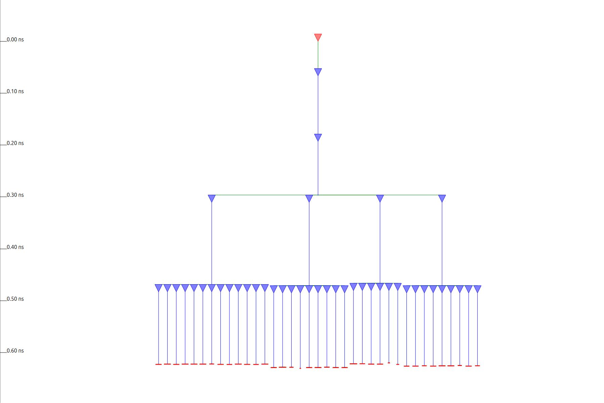
*Clock-tree distribution and buffering.*

CTS is important because the clock is a high-fanout signal. The physical
clock network affects:

- clock latency
- skew
- transition
- sequential timing
- data-path timing after CTS

The CTS checkpoint therefore forms the basis for the post-CTS
optimization and routing stages.

------------------------------------------------------------------------

# 8. Global Routing

Global routing creates routing guides and estimates how nets should
traverse the available routing resources.

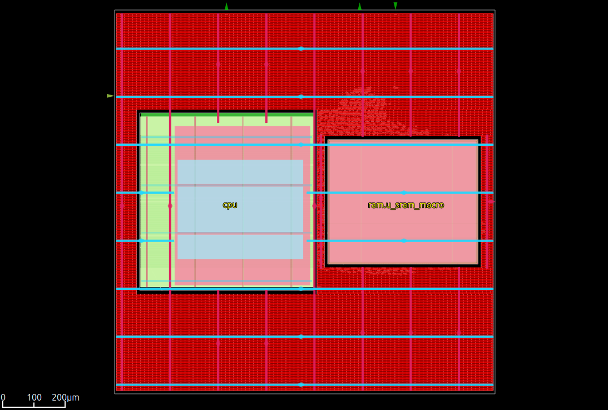
*Global routing checkpoint.*

Global routing is not yet the final manufacturable geometry. Instead, it
provides the routing plan used by detailed routing.

------------------------------------------------------------------------

# 9. Detailed Routing

Detailed routing converts the routing plan into actual metal tracks,
wire geometries and vias.

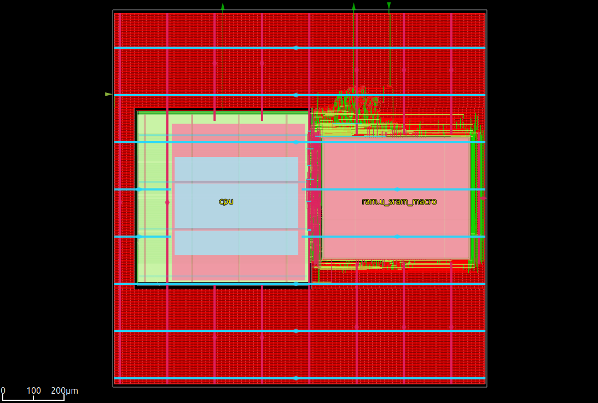
*Detailed routed implementation.*

The final routed design was subsequently subjected to ECO repair, RC
extraction, STA, antenna checking and physical verification.

The important final routing condition was:

``` text
Routing DRT markers: 0
```

This means the final physical database used for sign-off did not retain
routing DRT markers.

------------------------------------------------------------------------

# 10. ECO19 Timing Closure

The final implementation required a targeted ECO to close the remaining
electrical transition constraint on the SRAM interface.

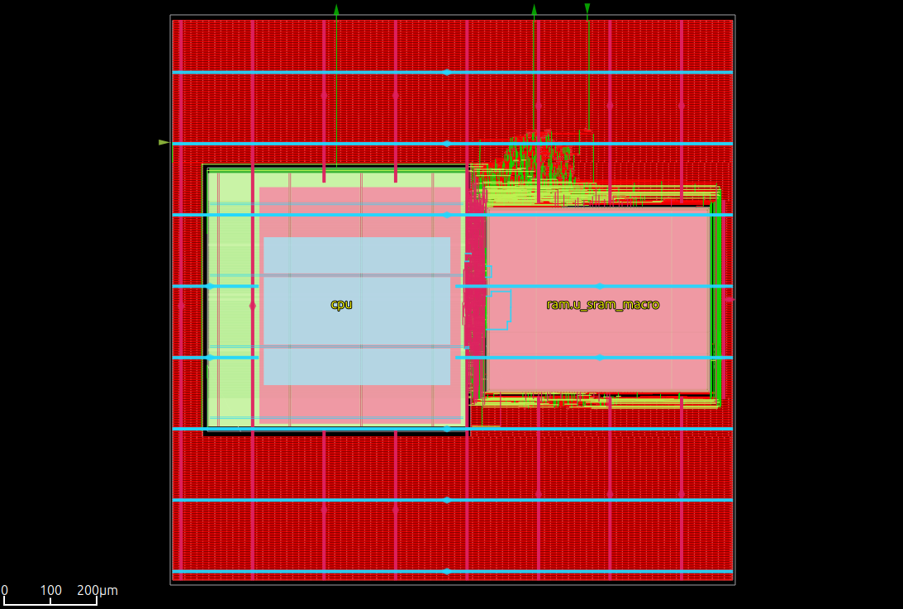
*ECO19 timing-closure checkpoint.*

### Problem

The SRAM interface contained address and write-mask inputs whose
transition time was close to or above the configured limit.

The effective maximum slew constraint was:

``` text
0.040 ns
```

The remaining problematic SRAM input groups were:

``` text
ram.u_sram_macro/addr0[0:7]
ram.u_sram_macro/addr1[0:7]
ram.u_sram_macro/wmask0[0:3]
```

### ECO Strategy

The ECO work focused on **targeted physical repair**, rather than a
broad re-route of the completed design. The key point was to diagnose
the failing electrical paths first, then make the smallest physical
change that improved transition without creating a timing or routing
regression.

The ECO methodology was:

``` text
Identify violating SRAM pins
        ↓
Inspect driver / fanout / capacitance / wire distance
        ↓
Classify root cause
        ↓
Driver upsizing or targeted buffer insertion
        ↓
Legalize placement
        ↓
Incremental / detailed routing
        ↓
RC extraction
        ↓
Multi-corner post-route STA
        ↓
DRC + antenna + LVS
```

For the SRAM inputs, the preferred physical repair order was:

1. Inspect the existing driver and routing topology.
2. Upsize a weak source driver when legal and timing-safe.
3. Insert an appropriately sized buffer close to the SRAM input when
   required.
4. Split long RC segments using buffer staging.
5. Create a dedicated SRAM branch for shared/high-fanout loads when
   appropriate.
6. Keep the final-stage buffer physically close to the SRAM input.
7. Avoid unnecessary buffer chains and avoid adding excessive load to
   upstream timing paths.

After every physical ECO, the modified database had to be legalized and
routed again before trusting the new STA result. This prevents an
optimization from being accepted based only on an idealized pre-route
timing calculation.

The ECO was retained only when the target electrical violation improved
without introducing setup, hold, max-capacitance, routing or physical
verification regressions.

### ECO Timing Result

The starting ECO analysis had already reached positive setup/hold slack,
so the remaining problem was primarily **maximum transition (slew)** on
the SRAM interface rather than a setup/hold violation. The diagnostic
baseline had approximately:

| Metric | Pre-ECO diagnostic baseline | Final ECO19 |
|:-------|----------------------------:|------------:|
| Setup WNS | **+1.5962 ns** | **+1.6043 ns** |
| Hold WNS | **+0.0876 ns** | **+0.0893 ns** |
| Max cap violations | **0** | **0** |
| Max slew violations | **20** | **0** |

The pre-ECO numbers above are the ECO4N timing-diagnostic baseline;
ECO4N itself was not treated as the final physical sign-off database.
The final physical implementation was taken from the known-good routed
baseline and then closed through the subsequent ECO flow.

The final ECO19 implementation achieved:

| Metric                     |                     Result |
|:---------------------------|---------------------------:|
| Worst SRAM input slew      |            **0.039473 ns** |
| Slew limit                 |            **0.040000 ns** |
| Remaining margin           | **0.000527 ns = 0.527 ps** |
| Max slew violations        |                      **0** |
| Max capacitance violations |                      **0** |
| Routing DRT markers        |                      **0** |

The final margin is small, so the ECO19 layout should be treated as a
**frozen sign-off candidate** rather than casually modified after
closure.

------------------------------------------------------------------------

# 11. Post-Route Static Timing Analysis

Post-route STA was performed after RC extraction using the final ECO19
physical implementation.

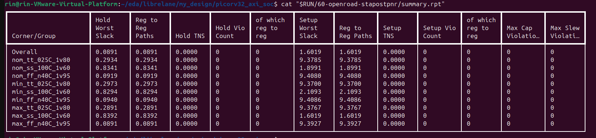
*Post-route multi-corner STA summary.*

### Native Verification Timing Summary

| Metric              |         Result |
|:--------------------|---------------:|
| Clock Period        |      **20 ns** |
| Target Frequency    |     **50 MHz** |
| Worst Setup WNS     | **+1.6043 ns** |
| Worst Hold WNS      | **+0.0893 ns** |
| Setup TNS           |       **0 ns** |
| Hold TNS            |       **0 ns** |
| Setup Violations    |          **0** |
| Hold Violations     |          **0** |
| Max Cap Violations  |          **0** |
| Max Slew Violations |          **0** |

The native verification covered nine timing corners.

| Corner   | Hold WNS (ns) | Setup WNS (ns) |
|:---------|--------------:|---------------:|
| `nom_tt` |       +0.2934 |        +9.3770 |
| `nom_ss` |       +0.8341 |        +1.8991 |
| `nom_ff` |       +0.0919 |        +9.4071 |
| `min_tt` |       +0.2974 |        +9.3687 |
| `min_ss` |       +0.8294 |        +2.1093 |
| `min_ff` |       +0.0940 |        +9.4078 |
| `max_tt` |       +0.2892 |        +9.3753 |
| `max_ss` |       +0.8392 |    **+1.6043** |
| `max_ff` |   **+0.0893** |        +9.3917 |

The worst setup and hold values remain positive, with zero setup/hold
violations.

> The timing values above are **STA results for this implementation and
> constraint set**. They should not be presented as characterized
> maximum silicon frequency.

------------------------------------------------------------------------

# 12. Antenna Verification

Antenna checking is performed to identify routed geometries that can
accumulate charge during fabrication and potentially stress gate oxides.

The final ECO19 implementation reported:

| Metric                 |   Result |
|:-----------------------|---------:|
| Antenna Violating Nets |    **0** |
| Antenna Violating Pins |    **0** |
| Final Antenna Status   | **PASS** |

The final physical flow therefore completed antenna checking without
remaining reported violations.

------------------------------------------------------------------------

# 13. Design Rule Checking

Physical DRC checks whether the final geometry satisfies the
manufacturing rules evaluated by the selected verification flow.

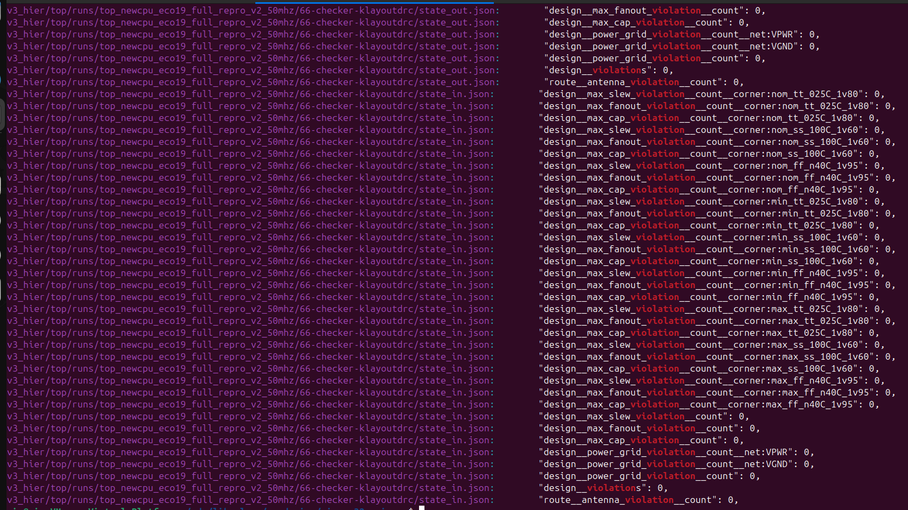
*Final DRC verification result.*

### Final DRC Result

| Check               |   Result |
|:--------------------|---------:|
| Routing DRT markers |    **0** |
| KLayout DRC errors  |    **0** |
| KLayout DRC         | **PASS** |
| Illegal overlaps    |    **0** |

### DRC / Routing Closure Method

DRC closure was handled as part of the physical ECO flow rather than by
editing the final layout geometry manually. After any ECO cell resize or
buffer insertion, the physical database was:

1. legalized so that new cells occupied legal sites;
2. checked for placement legality and connectivity;
3. incrementally/detailed-routed as required;
4. checked for routing DRT markers; and
5. re-verified with the selected foundry DRC flow.

New ECO cells also had to have valid signal connectivity and power/ground
connectivity before the database could be considered a valid physical
checkpoint.

The final implementation reached zero routing DRT markers, zero illegal
overlaps and zero reported KLayout DRC errors.

The final full reproducibility run also reported DRC as passed in the
manufacturability report.

> **Magic DRC:** a Magic DRC result was not reported in the final 81/81
> full-reproduction run. Therefore this project does not claim Magic DRC
> PASS for the final full flow.

------------------------------------------------------------------------

# 14. Layout Versus Schematic

LVS compares the circuit extracted from the physical layout with the
reference netlist.

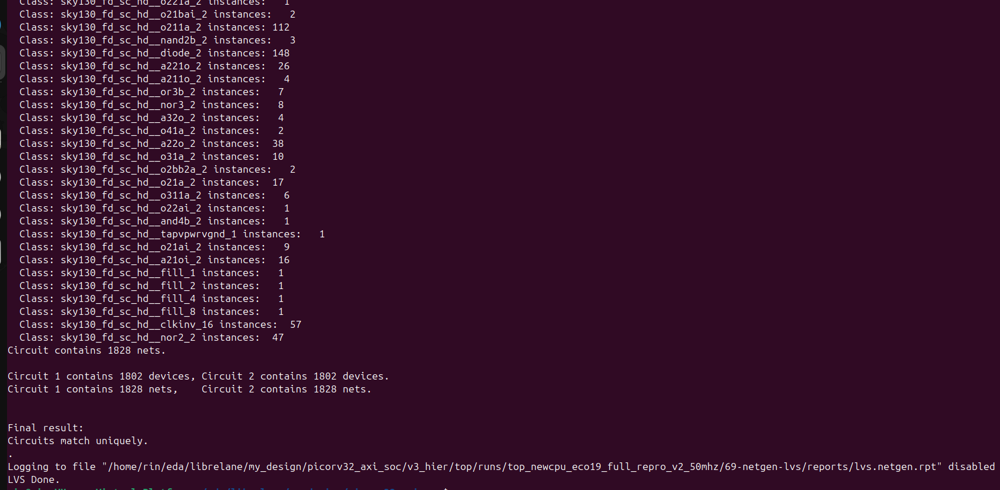
*Netgen LVS verification.*

### LVS Results

| Check             |                      Result |
|:------------------|----------------------------:|
| Layout devices    |                    **1802** |
| Reference devices |                    **1802** |
| Layout nets       |                    **1828** |
| Reference nets    |                    **1828** |
| Unmatched devices |                       **0** |
| Unmatched nets    |                       **0** |
| Unmatched pins    |                       **0** |
| Property failures |                       **0** |
| Netgen result     | **Circuits match uniquely** |

This provides evidence that the extracted physical circuit matches the
reference connectivity for the final sign-off database.

### LVS Consistency / Mismatch Prevention

A critical LVS requirement in an ECO flow is that the physical database
and logical reference netlist belong to the **same implementation
revision**. Mixing an older physical extraction with a newer or older
logical netlist can create apparent LVS mismatches that are caused by
state mixing rather than by an actual layout connectivity error.

For final validation, the following sources were kept aligned to the
same ECO implementation:

``` text
Physical ODB
Physical DEF
Final GDS
Post-ECO logical netlist
        ↓
      Netgen LVS
```

Before running LVS, the physical and logical source paths should be
printed and checked for the same ECO revision. If the sources are from
different revisions, the correct matching post-ECO netlist/extraction
must be selected before interpreting the LVS result.

This source-consistency check is especially important in a hierarchical
flow because CPU hard-macro collateral, top-level routing databases and
post-ECO netlists may exist in multiple historical run directories.

------------------------------------------------------------------------

# 15. Final GDSII

After routing, ECO closure, RC extraction and physical verification, the
final layout was streamed to GDSII.


*Full-chip final GDSII/layout view.*

### CPU Macro Detail

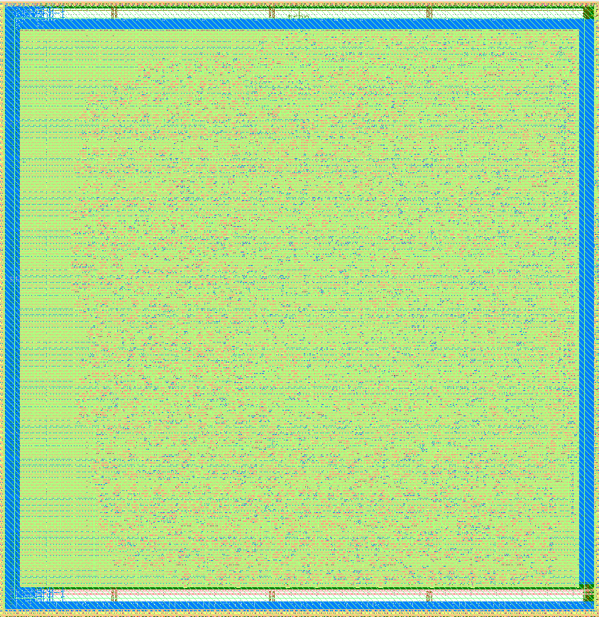
*CPU hard macro physical implementation.*

### SRAM Macro Detail

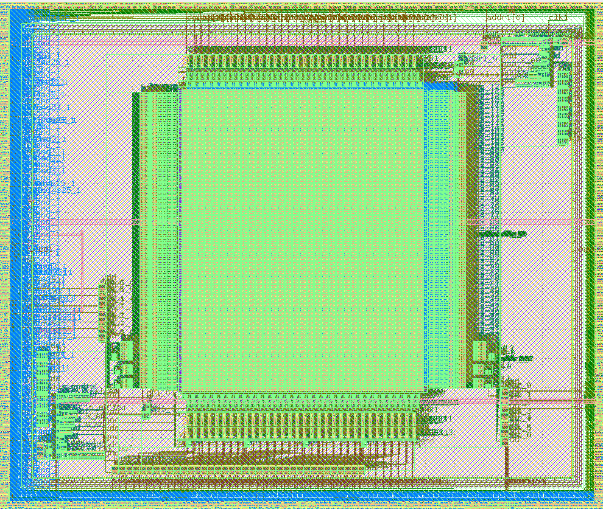
*Integrated SKY130 SRAM macro.*

### CPU ↔ SRAM Routing

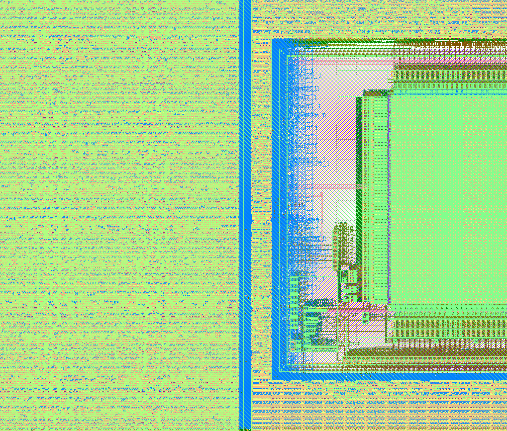
*Top-level routing between the hierarchical CPU and SRAM regions.*

The final GDSII represents the physical implementation after the
complete sequence of floorplanning, macro integration, placement, CTS,
routing, ECO repair, extraction and verification.

------------------------------------------------------------------------

# Final Results

## Physical Implementation

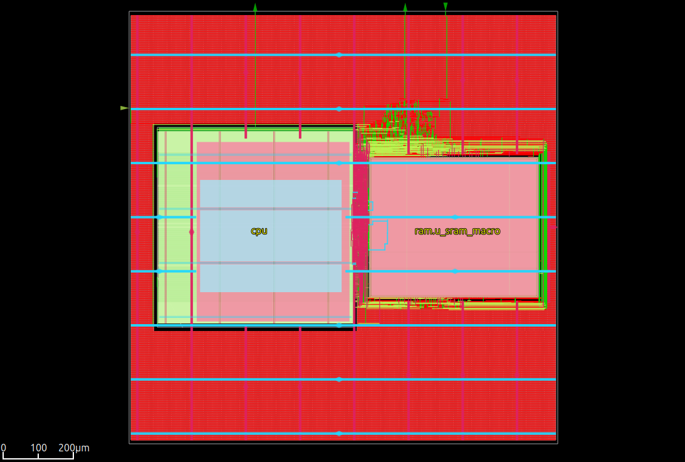
*Final physical implementation checkpoint.*

| Category     | Metric                     |      Result |
|:-------------|:---------------------------|------------:|
| Technology   | SKY130                     |           — |
| Timing       | Clock Period               |       20 ns |
| Timing       | Target Frequency           |      50 MHz |
| Area         | Final Instance Utilization |    37.5833% |
| Area         | Standard-Cell Utilization  |     4.0435% |
| Timing       | Setup WNS                  |  +1.6043 ns |
| Timing       | Hold WNS                   |  +0.0893 ns |
| Timing       | Setup Violations           |           0 |
| Timing       | Hold Violations            |           0 |
| Electrical   | Max Slew Violations        |           0 |
| Electrical   | Max Cap Violations         |           0 |
| Routing      | DRT Markers                |           0 |
| Antenna      | Violating Nets             |           0 |
| Antenna      | Violating Pins             |           0 |
| Verification | KLayout DRC                |        PASS |
| Verification | LVS                        |        PASS |
| Verification | LVS Devices                | 1802 / 1802 |
| Verification | LVS Nets                   | 1828 / 1828 |
| Flow         | Full RTL-to-GDSII          |     81 / 81 |

------------------------------------------------------------------------

# Full RTL-to-GDSII Reproducibility

A major goal of this project was not merely to preserve a final routed
database, but to demonstrate that the implementation can be reproduced
from the RTL and configuration.

The final full reproducibility run:

``` text
top_newcpu_eco19_full_repro_v2_50mhz
```

completed:

``` text
Stage 81 / 81
Flow complete.
```

The flow covered:

``` text
RTL
 ↓
Synthesis
 ↓
Floorplan
 ↓
Macro integration
 ↓
PDN
 ↓
Placement
 ↓
CTS
 ↓
Global routing
 ↓
Detailed routing
 ↓
ECO19
 ↓
RCX
 ↓
Post-route STA
 ↓
Antenna
 ↓
GDSII
 ↓
KLayout DRC
 ↓
Netgen LVS
 ↓
Final checkers
```

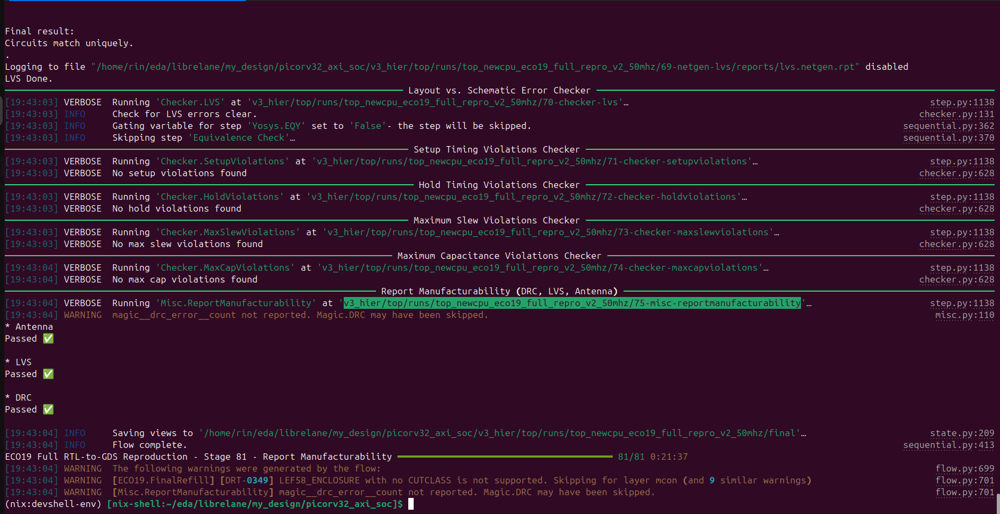
*Complete 81/81 LibreLane full-flow execution.*

The final flow reported:

- Netgen: **1802 / 1802 devices**
- Netgen: **1828 / 1828 nets**
- `Circuits match uniquely`
- Setup violations: **0**
- Hold violations: **0**
- Max slew violations: **0**
- Max capacitance violations: **0**
- Antenna: **PASS**
- LVS: **PASS**
- DRC: **PASS**
- Flow: **81 / 81 completed**

The full run therefore demonstrates reproducibility of the
physical-design process rather than simply documenting an isolated final
database.

------------------------------------------------------------------------

# Repository Structure

``` text
picorv32_axi_soc/
│
├── README.md
├── .gitignore
│
├── src/
│   ├── priority_encoder.v
│   ├── arbiter.v
│   ├── axil_interconnect.v
│   ├── axil_sram.v
│   ├── boot_rom.v
│   ├── uart_tx.v
│   └── uart_axil.v
│
├── tb/
│   ├── uart_soc_tb.v
│   ├── soc_tb.v
│   ├── axil_sram_tb.v
│   └── ...
│
├── docs/
│   └── images/
│       ├── 01_boot_rom_uart_demo.png
│       ├── 02_rtl_uart_simulation.png
│       ├── 03_soc_architecture.png
│       ├── 03_synthesis.png
│       ├── 04_floorplan.png
│       ├── 05_macro_placement.png
│       ├── 06_pdn.png
│       ├── 07_global_placement.png
│       ├── 08_detailed_placement.png
│       ├── 09_cts.png
│       ├── 09_cts_clock_tree.png
│       ├── 10_global_routing.png
│       ├── 11_detailed_routing.png
│       ├── 12_eco19.png
│       ├── 13_final_layout.png
│       ├── 14_sta.png
│       ├── 15_final_gds.png
│       ├── 15a_final_gds_cpu.png
│       ├── 15b_final_gds_sram.png
│       ├── 15c_cpu_sram_routing.png
│       ├── 16_drc.png
│       ├── 17_lvs.png
│       └── 18_flow_complete.png
│
├── v3_hier/
│   ├── cpu/
│   ├── macros/
│   └── top/
│
└── licenses/
```

Generated LibreLane/OpenROAD `runs/`, `runs_archive/`, `results/` and
other large intermediate databases are intentionally excluded from Git
version control.

Curated source files, scripts, constraints, macro collateral,
documentation and screenshots are retained.

------------------------------------------------------------------------

# Reproducing the Flow

## Environment

The implementation was developed with:

``` text
LibreLane v3.0.1
OpenROAD commit dcf36133a369abc3f5e5738cd4d82e4903c0e0
SkyWater SKY130 PDK
sky130_fd_sc_hd
```

The PDK was supplied through the Ciel-managed SKY130 installation.

### Main Full-Reproduction Configuration

``` text
v3_hier/top/config_top_newcpu_eco19_full_repro_50mhz.json
```

### Main PnR SDC

``` text
v3_hier/top/constraints/top_50mhz_eco19_repro_pnr.sdc
```

### Example Full-Flow Invocation

From the project root:

``` bash
cd ~/eda/librelane/my_design/picorv32_axi_soc

librelane \
  --manual-pdk \
  --pdk-root /path/to/sky130/pdk \
  --run-tag top_newcpu_eco19_full_repro_v2_50mhz \
  v3_hier/top/config_top_newcpu_eco19_full_repro_50mhz.json
```

> The exact PDK root is installation-specific. The repository
> intentionally does not hard-code a user’s local filesystem path.

### Inspecting the Layout

OpenROAD can be used to inspect an ODB checkpoint:

``` bash
openroad -gui
```

Then:

``` tcl
read_db <path-to-soc_top.odb>
gui::fit
```

KLayout can be used to inspect the final GDSII.

------------------------------------------------------------------------

# Engineering Notes

## ECO19 Was a Targeted Timing/Electrical Closure

The final physical implementation was not produced by repeatedly
re-routing the entire design. The ECO19 work targeted the remaining
SRAM-interface transition problem while preserving the already-clean
routed implementation.

This distinction is important for physical-design engineering:

``` text
Initial routed design
        ↓
Identify exact failing nets/pins
        ↓
Driver / load / RC diagnosis
        ↓
Targeted resize / buffer ECO
        ↓
Legalize + incremental route
        ↓
RC extraction
        ↓
Multi-corner STA
        ↓
DRC + antenna + LVS
```

The final worst SRAM transition was:

``` text
0.039473 ns
```

against:

``` text
0.040000 ns
```

leaving only:

``` text
0.527 ps
```

of margin.

For that reason, the final ECO19 layout is treated as a **frozen
sign-off candidate**. Any later area or whitespace optimization should
be performed as a separate branch followed by a complete re-run of PnR,
RC extraction, STA, DRC and LVS.

## Hierarchical Design Matters

The final top-level utilization is strongly affected by the hard CPU and
SRAM macros.

Therefore:

``` text
Yosys synthesized cell area
```

and:

``` text
final physical instance utilization
```

describe different implementation levels and should not be compared as
if they were the same metric.

## Verification Discipline

The project deliberately separates:

- timing closure
- electrical constraints
- routing cleanliness
- antenna checks
- DRC
- LVS
- full-flow reproducibility

A design passing setup/hold does not by itself prove that every physical
or electrical rule has been satisfied. Similarly, a DRC-clean layout
does not replace LVS.

For this project, final closure was therefore treated as a chain of
independent checks:

``` text
Timing / Slew
    +
Routing / DRT
    +
Antenna
    +
DRC
    +
LVS
    +
Full-flow reproducibility
    ↓
Final sign-off candidate
```

------------------------------------------------------------------------

# References

- PicoRV32 / YosysHQ
- LibreLane
- OpenROAD
- SkyWater SKY130 PDK
- KLayout
- Magic VLSI
- Netgen

The project uses open-source RTL and open-source physical-design
tools/PDK collateral. Upstream licenses are retained where applicable.

------------------------------------------------------------------------

# Key Takeaways

This project demonstrates hands-on experience with:

- Hierarchical ASIC RTL-to-GDSII implementation
- PicoRV32-based RISC-V SoC integration
- AXI-Lite interconnect design
- Boot ROM and UART bring-up
- SKY130 standard-cell physical design
- Hard-macro integration
- SRAM integration
- Floorplanning
- Power Distribution Network generation
- Global and detailed placement
- Clock Tree Synthesis
- Global and detailed routing
- ECO timing/electrical closure
- RC parasitic extraction
- Multi-corner Static Timing Analysis
- Antenna verification
- KLayout DRC
- Netgen LVS
- GDSII generation and inspection
- Reproducible 81-stage RTL-to-GDSII execution

------------------------------------------------------------------------

# Final Status

**RTL → GDSII: COMPLETED ✅**

**Setup Timing: PASS ✅**

**Hold Timing: PASS ✅**

**Max Slew: PASS ✅**

**Max Capacitance: PASS ✅**

**Antenna: PASS ✅**

**KLayout DRC: PASS ✅**

**LVS: PASS ✅**

**Full Flow: 81 / 81 ✅**

The final implementation is a completed RTL-to-GDSII physical-design
project with a clean routed database, closed setup/hold timing, zero
reported max-slew/max-cap violations, antenna PASS, KLayout DRC PASS,
LVS PASS and a fully reproducible 81/81 LibreLane flow.

> **Important:** Magic DRC was not reported in the final
> full-reproduction run, so it is intentionally not listed as a final
> PASS result.
